# Simulator Screenshots

<div style="display: flex; flex-wrap: wrap; gap: 10px;">
  
  
  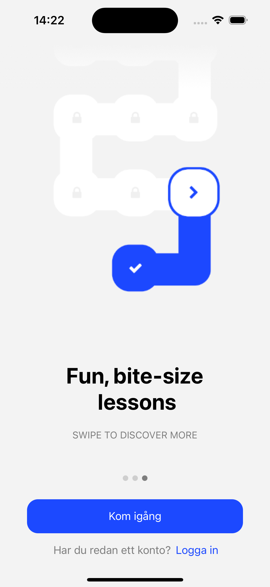
  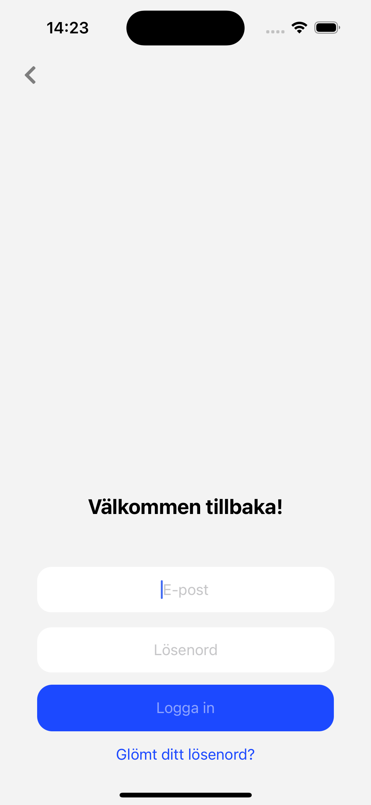

  
  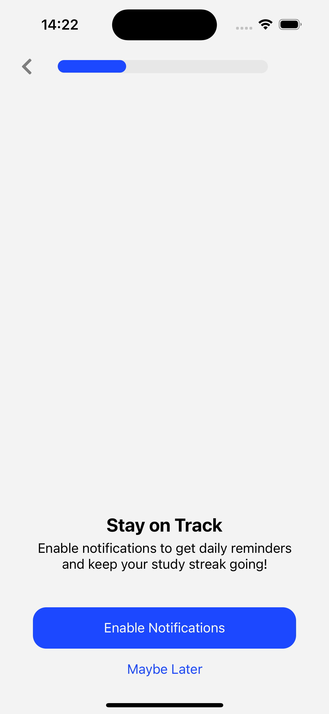
  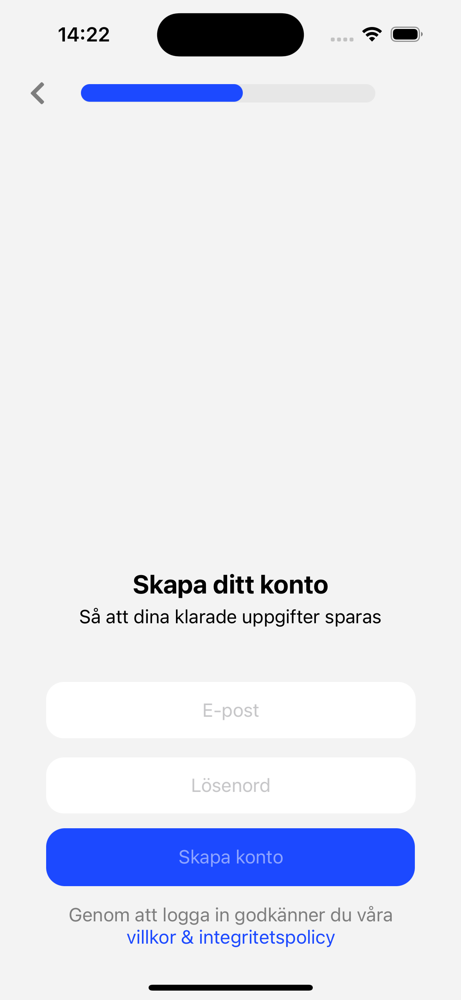
  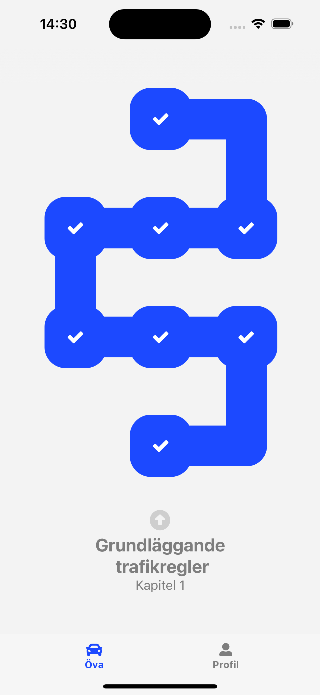

  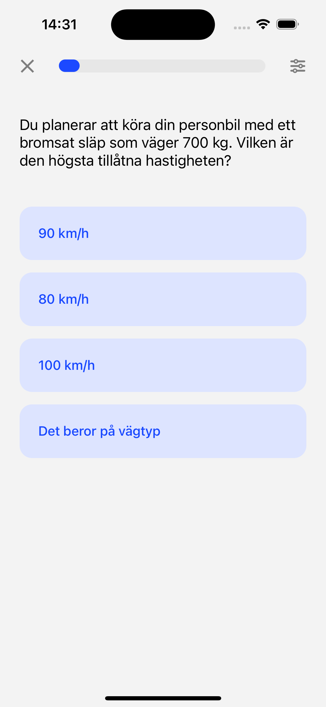
  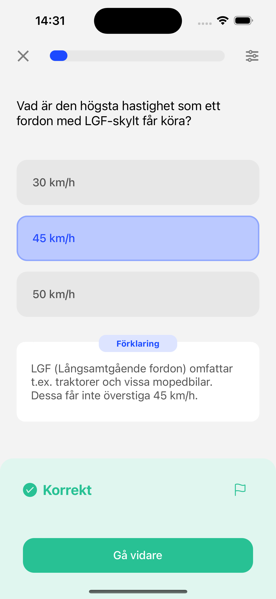
  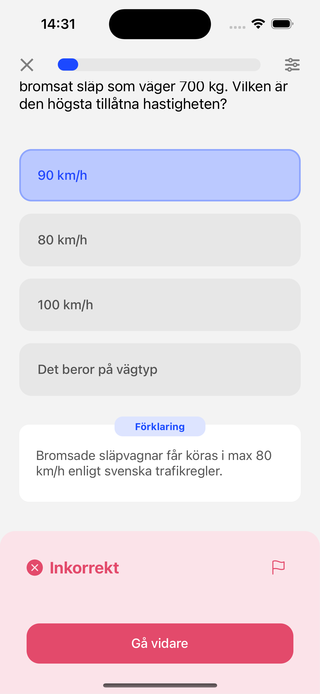
  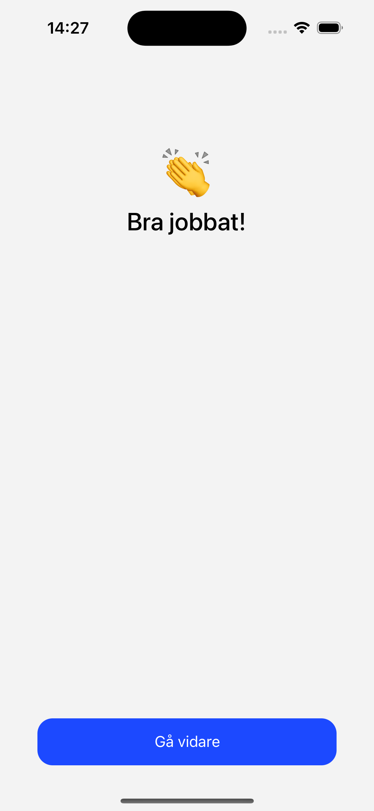

  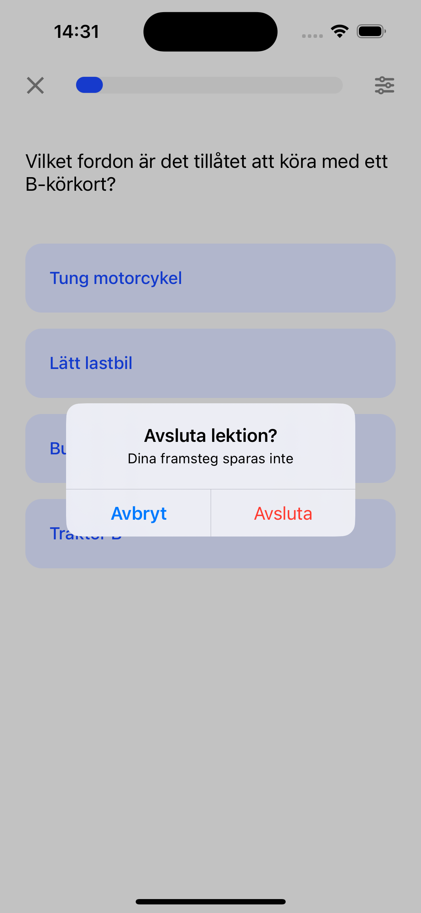
  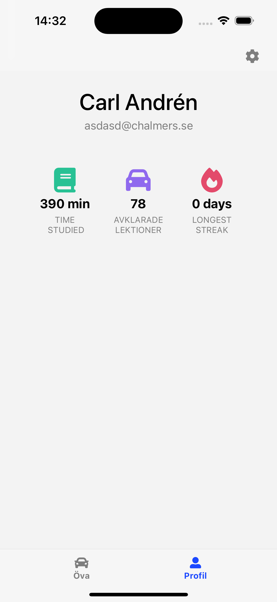
  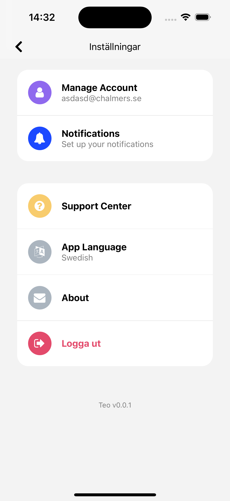
  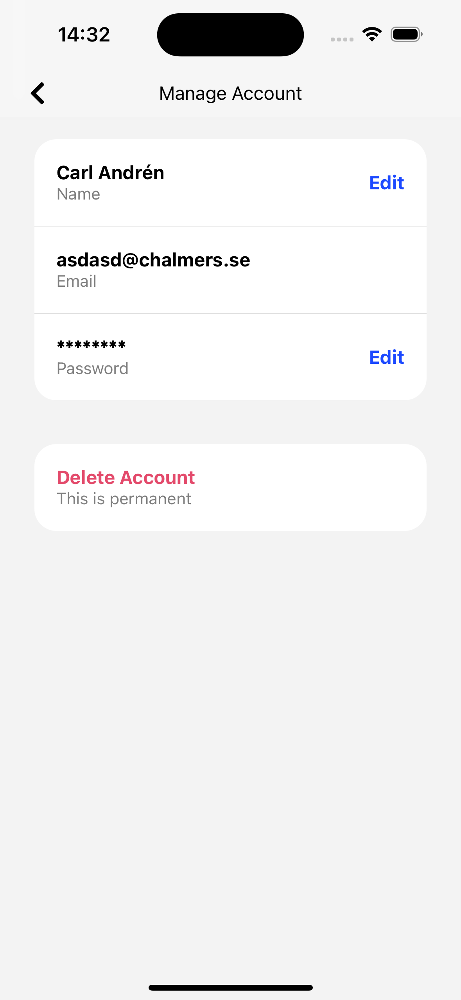

  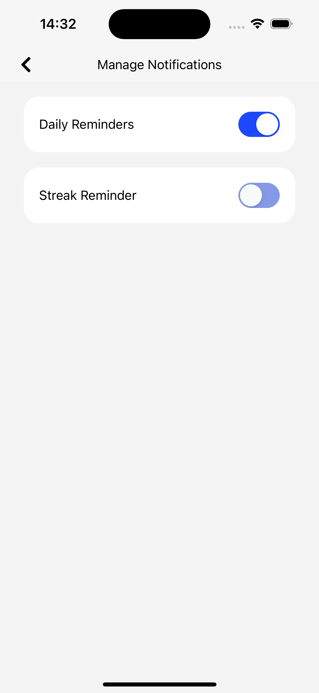
</div>

## Setup Guide

### Prerequisites
Ensure you have the following installed:
- Node.js (LTS version recommended)
- React Native CLI or Expo CLI
- Android Studio / Xcode (for building on Android/iOS)
- Unity 6 (latest LTS version recommended)
- AWS account and CLI configured

## Getting Started

### 1. Clone the Repository
Clone the repository and navigate into the project folder:
  ```bash
  git clone https://github.com/carlandren2002/react-unity-project.git
  cd react-unity-project
  ```
### 2. Install Dependencies

Install all required dependencies:

  ```bash
  npm install
  ```
### 3. iOS Setup
  ```bash
  cd ios
  pod install
  cd ..
  npm run ios
  ```
### 4. Android Setup
  ```bash
  npm run android
  ```
### 5. AWS Amplify Configuration
  ```bash 
  amplify init
  ```

### 6. Adding Unity as a Library

To integrate Unity into your React Native project, follow the steps outlined in the [react-native-unity guide](https://github.com/azesmway/react-native-unity)


### Additional Resources
- [React Native Documentation](https://reactnative.dev/docs/environment-setup)
- [Unity Documentation](https://docs.unity3d.com/Manual/index.html)
- [AWS CLI Documentation](https://docs.aws.amazon.com/cli/latest/userguide/install-cliv2.html)
